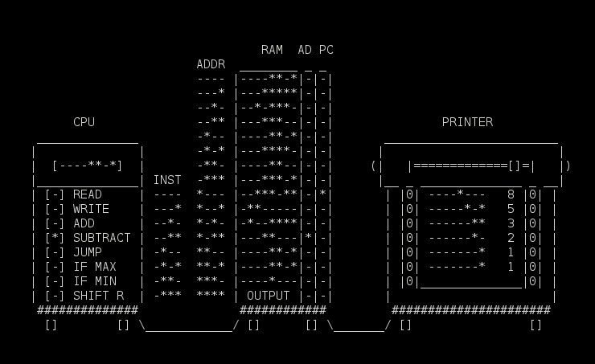

Comp
====

Simple 4-bit/1 Hz virtual computer for learning purposes



Memory
------
```
instructions - 4 bits
  |  +-- adresses - 4 bits
  v  v
----***-  <- 0  ----
--*-**-*  <- 1  ---*
---***--  <- 2  --*-
---*****  <- 3  --**
----***-  <- 4  -*--
---***-*  <- 5  -*-*
----**--  <- 6  -**-
---****-  <- 7  -***
-***---*  <- 8  *---
-*--****  <- 9  *--*
--------  <- 10 *-*-
--------  <- 11 *-**
--------  <- 12 **--
-------*  <- 13 **-*
-------*  <- 14 ***-
<OUTPUT>  <- 15 ****
```

* Execution starts at the first address (0). 
* Execution stops when program reaches last address (15)
* Whatever gets written to the last adress is send to the printer.
* Computer has one 8 bit register.
* When reading from the last address (15), we get a random byte value.

Instruction set
---------------

* `READ     ----` - Copies the value at the specifed address into register.  
* `WRITE    ---*` - Copies value of the register to the specified address.  
* `ADD      --*-` - Adds value at the speicfied address to the value of the register, and writes result to the register. If the result is bigger than the maximum possible value (255 = ********) then 255 gets written.  
* `SUBTRACT --**` - Subtreacts value at the speicfied address from the value of the register, and writes result to the register. If the result is smaller than 0 then 0 gets written.  
* `JUMP     -*--`  - Changes the value of the program counter to the specified address, meaning that in the next cycle execution will continue at that address.  
* `IF MAX   -*-*` - Jumps to the specified address if the register hold value 255 = `********`. 
* `IF MIN   -**-` - Jumps to the specified address if the register hold value 0 = `--------`. 
* `SHIFT R -***` - Moves every bit of the register one spot to the right. This way rightmost bit gets lost, and a leftmost becomes `-`. This is the only instruction that doesn't use the address part, making the last four bits irrelevant.  

How to run on…
--------------

### Windows

* Download and install [wget](http://sourceforge.net/projects/gnuwin32/files/wget/1.11.4-1/wget-1.11.4-1-setup.exe/download)
* Open command prompt
* Go to the directory where you want Cygwin installed
* Install and start Cygwin:

>```bat
setx PATH "%PATH%;C:\Program Files (x86)\GnuWin32\bin"
wget --no-check-certificate https://cygwin.com/setup-x86_64.exe
mkdir cygwin
setup-x86_64.exe --quiet-mode --no-shortcuts --site http://cygwin.mirror.constant.com --root %cd%\cygwin -P git -P gcc-g++ -P ncurses -P vim-common -P libgcc1 -P libclang-devel -P make -B
cygwin\Cygwin.bat
```

* Run the UNIX commands  

### UNIX
```bash
git clone https://github.com/gto76/comp-cpp.git
cd comp
bash run
```


